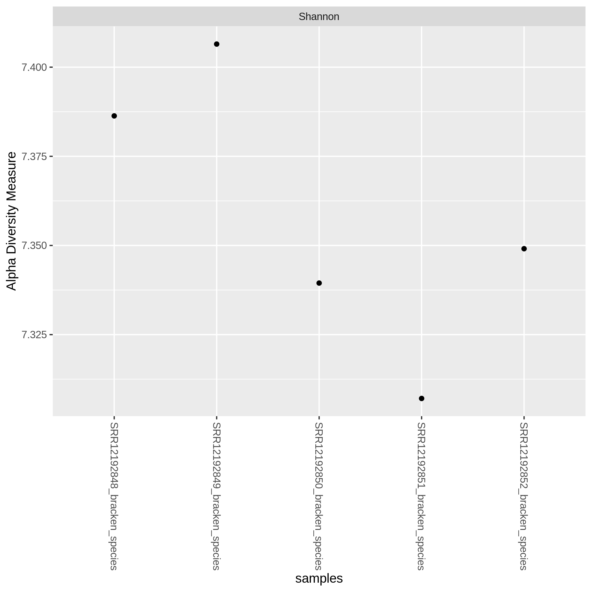
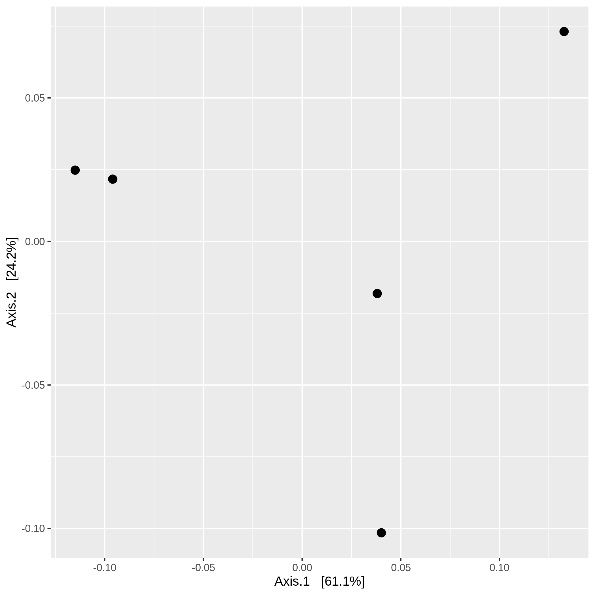

# $\alpha$ and $\beta$ diversity analyses in R.

$\alpha$-diversity measures the "richness" of taxa within a community. $\beta$-diversity on the other hand measures how different the comunities are in their richness. These analyses will be performed on 5 samples of maize rhizosphere of the project BioProject:PRJNA645385. 

## Load libraries and data for analyses.

In an R console (install version 4.1.3 in new conda enviroment if necessary) install and load the following packages.
 
~~~
> install.packages('vegan') #functions for community ecology
> install.packages('ggplot2') 
> if(!requireNamespace("BiocManager")){
  install.packages("BiocManager")
}
BiocManager::install("phyloseq") #tool to import, analyze, phylogenetic sequencing data clustered into OTUs
~~~
{: .r-language}

~~~
> library(vegan)
> library(ggplot2)
> library(phyloseq)
~~~
{: .r-language}

Load .biom file obtained from bracken reports of the 5 samples. Bracken reports were obtained by applying [Bracken](http://ccb.jhu.edu/software/bracken/index.shtml) (Bayesian Reestimation of Abundance with KrakEN), a statistical method that computes the abundance of species from kraken reports.

~~~
> SRR121928_metagenomes <- import_biom('~/Metagenomics/Data/bracken_biom/SRR121928_bracken.biom')
~~~

The variable thus loaded is a phyloseq-class object with an OTU_table and a Tax_table. 

~~~
> SRR_metagenomes
~~~
{: .r-language}

~~~
phyloseq-class experiment-level object
otu_table()   OTU Table:         [ 87 taxa and 3 samples ]
tax_table()   Taxonomy Table:    [ 87 taxa by 7 taxonomic ranks ]
~~~
{: .output}

## $\alpha$-diversity analysis

For $\alpha$-diversity analysis phyloseq can use several diversity measures such as Shannon Index, Simpson's and Chao1. Here we make the analysis with the Shannon Index. 

~~~
> plot_richness(physeq = SRR121928_metagenomes, 
              measures = "Shannon") 
~~~

## $\beta$-diversity analysis

PCoA
~~~
> data_otu_SRR121928 <- data.frame(otu_table(SRR121928_metagenomes))

> dist_bc_SRR121928 <- as.matrix(vegdist(data_otu_SRR121928, method = "bray"))
~~~

~~~
> pcoa_bc = ordinate(SRR121928_metagenomes, "PCoA", "bray")

> plot_ordination(SRR121928_metagenomes, pcoa_bc, color = "site") + 
  geom_point(size = 3)
~~~

## References

